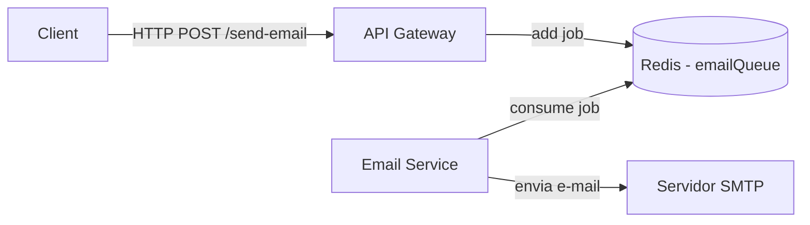

# 📧 Microserviço de Envio de E-mails (NestJS + BullMQ + Redis)

Este projeto é composto por dois serviços:

- **email-service**: microserviço responsável por processar e enviar e-mails via fila (BullMQ + Redis).
- **api-gateway**: API principal que recebe requisições externas e adiciona jobs à fila de envio de e-mails.

---

## 🚀 Tecnologias Utilizadas

- [NestJS](https://nestjs.com/)
- [BullMQ](https://docs.bullmq.io/)
- [Redis](https://redis.io/)
- [Nodemailer](https://nodemailer.com/)
- [Docker](https://www.docker.com/)
- [Bull Board](https://github.com/vcapretz/bull-board) – interface para monitoramento das filas

---

## 🧩 Arquitetura



- O `api-gateway` valida e enfileira as requisições.
- O `email-service` consome os jobs do Redis e envia e-mails usando Nodemailer.
- O Redis funciona como broker da fila.

---

## 🛠 Pré-requisitos

- Node.js v16+
- Docker e Docker Compose
- Yarn ou npm
- Redis (pode ser local ou via Docker)

---

## 📁 Estrutura do Projeto

```
.
├── api-gateway/         # Serviço que expõe o endpoint público
├── email-service/       # Serviço que processa os jobs e envia os e-mails
├── docker-compose.yml   # Para subir Redis
└── README.md
```

---

## ⚙️ Configuração

### 1. Clonar o projeto

```bash
git clone https://github.com/MarthinKorb/nest-mail-queue.git
cd nest-mail-queue
```

### 2. Criar os arquivos `.env`

#### `email-service/.env`

* Dica para testes de envio de email: utilizar o ethereal `https://ethereal.email/login`

```env
REDIS_HOST=localhost
REDIS_PORT=6379

SMTP_HOST=smtp.seuservidor.com
SMTP_PORT=587
SMTP_USER=seu@dominio.com
SMTP_PASS=sua_senha
FROM_EMAIL=seu@dominio.com
FROM_NAME=Seu Nome
```

#### `api-gateway/.env`

```env
EMAIL_SERVICE_URL=http://localhost:3001
PORT=3000
JWT_SECRET=sua_chave_secreta
```

---

## 🐳 Subir o Redis com Docker

```bash
docker-compose up -d
```

### Exemplo `docker-compose.yml`

```yaml
version: "3.8"
services:
  redis:
    image: redis:7-alpine
    container_name: redis
    ports:
      - "6379:6379"
```

---

## 📦 Rodar os serviços

### Terminal 1: `email-service`

```bash
cd email-service
npm install
npm run start:dev
```

### Terminal 2: `api-gateway`

```bash
cd api-gateway
npm install
npm run start:dev
```

---

## 🔐 Autenticação (PENDENTE)

O `api-gateway` usa autenticação JWT nos endpoints. Envie um token válido no header:

```http
Authorization: Bearer <seu_token_jwt>
```

> O middleware `JwtAuthGuard` valida o token antes de permitir a criação de jobs.

---

## 📬 Enviar um e-mail (Exemplo)

**POST** `http://localhost:3000/send-email`

```json
{
  "to": "cliente@exemplo.com",
  "subject": "Bem-vindo!",
  "text": "Olá, obrigado por se cadastrar!"
}
```

---

## 📊 Monitoramento com Bull Board

Acesse: [http://localhost:3002/admin/queues](http://localhost:3002/admin/queues)

---

## 🛡 Boas práticas aplicadas

- ✅ Validação de payloads com `class-validator`
- ✅ Autenticação JWT nos endpoints
- ✅ Retry automático e `backoff` configurado na fila
- ✅ Separação clara de responsabilidades
- ✅ Enfileiramento assíncrono para escalabilidade

---

## 📚 Referências

- [NestJS - Documentação oficial](https://docs.nestjs.com/)
- [BullMQ - Guide](https://docs.bullmq.io/)
- [Nodemailer](https://nodemailer.com/about/)
- [Redis](https://redis.io/)
- [Bull Board](https://github.com/vcapretz/bull-board)
